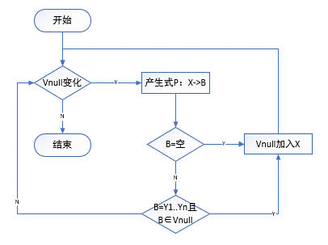
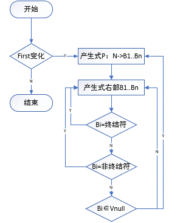
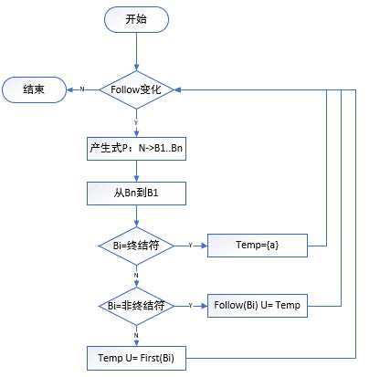
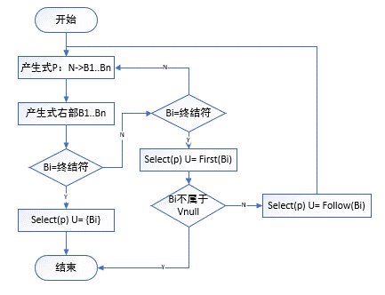

# 编译原理第二次过程报告

刘晨阳 20184488 物联网1801

## 任务

1. 符号表设计
2. 词法分析
3. 语法分析
4. 语义分析
5. 接口对接
6. 测试代码

### 词法分析器设计

​       词法分析器主要功能是为语法分析器提供TOKEN串。该部分包含一个头文件：lexical.h 。词法分析器将准备编译的源代码作为输入，利用设计好的确定的有限自动机的状态转移函数，实现状态的转移和对语句的分词功能。根据终结状态将分词划分为六类：关键字、标识符、界符、常数常量、字符常量和字符串常量。最后再生成对应的TOKEN串。

流程图:


### 语法分析设计

​		 输入为词法分析器产生的token串流，include”grammar.h”的头文件以及”lexer.h”词法分析器的头文件，通过对文法的解析，自动生成First，Follow，Select等集合，进而有Select集合自动构建LL1分析表，根据自动生成的LL1分析表，进行语法分析，以及为后续的四元式产生及语义分析做前置准备工作。语法分析的同时可以利用符号表中的信息进行类型检查。



​                                                             求非空null集合



​                                                                       求first集合



​                                                          求follow集合



​                                                求select集合


### 语义分析设计

​		包含了文法的头文件以及符号表的头文件，根据输入的语义动作进行语法制导翻译，通过语法分析中自动生成的LL1分析表，将动作当作文法右部变元同等处理，逆序压栈，当遇到语义动作的非终结符时，执行相应的语义动作，同时将产生的四元式输出并存储到vector<quat>的结构中，作为下一阶段四元式优化的输入部分。

```c++
struct Parser {//语义分析部分数据结构
    map<pair<int, int>, int> LL1Table;
    Grammar gram;
    Lexer lex;
    vector<Token> tokens;
    stack<int> SEM;
    stack<int> SToken;
    int cnt_t = 0;        //for encode t1..t2
    vector<Quat> quats;
    Action acts[maxn];
    vector<string> acttype{"GEQ", "PUSH", "ASSI", "IF", "ELSE", "ENDIF", "LAB", "GOTO"
    "WE", "WH", "DO"};
    SymTable symtbl;


    void Get_Action();
    void Debug_LL1(stack<int>, int, int);
    void Get_LL1Table();
    void LL1();
    void GEQ(int, int);
    void PUSH(int, int);
    void ASSI();
    void IF();
    void ELSE();
    void ENDIF();
    void LAB();
    void GOTO();
    void WE();
    void WH();
    void DO();
    void Get_Quats();
    void Print_Quat(Quat);
    void Print_Act(Action);
    void Debug_Quats(stack<int>, stack<Action>, int, int);
    int Get_Type(int, int);
};

```

**产生四元式**

**代码实现**

```c++
void Parser::Get_Quats() {
    stack<int> S;
    stack<Action> SACT;
    S.push(gram.Start);
    int d = 0;
    while(!S.empty()) {
        int i = S.top(), j = tokens[d].Vt_id;
//        printf("level = %d\n", tokens[d].level);
//        Debug_Quats(S, SACT, j, d);
        if(i == -1) {   //action is the top
            S.pop();
            if(SACT.empty()) { puts("SACT is null!"); exit(0); }
            Action act = SACT.top(); SACT.pop();
//            printf("act = %s\n", acttype[act.type-1].c_str());
//            printf("act = %d\n", act.type);
            if(act.type == 1) {     //GEQ
                GEQ(act.object, act.tokenid);
            }
            else if(act.type == 2) {
                PUSH(act.object, act.tokenid);
            }
            else if(act.type == 3) {
                ASSI();
            }
            else if(act.type == 4) {
                IF();
            }
            else if(act.type == 5) {
                ELSE();
            }
            else if(act.type == 6) {
                ENDIF();
            }
            else if(act.type == 7) {
                LAB();
            }
            else if(act.type == 8) {
                GOTO();
            }
            else if(act.type == 9) {
                WE();
            }
            else if(act.type == 10) {
                WH();
            }
            else if(act.type == 11) {
                DO();
            }
        }
        else if(gram.Vt.count(i)) {
            if(S.top() == j) {
                d++;
                S.pop();
            }
        }
        else if(gram.Vn.count(i)) {
            S.pop();
            if(LL1Table.count({i, j})) {
                vector<int> rev;
                int k = 0;      //count the position
                int t = LL1Table[{i, j}];   //the index of product
                for(auto x : gram.Gram[t].se) {
                    if(gram.names[x] == "~") continue;
                    rev.pb(x);
                    if(acts[t].type == 0) continue;
                    if(k == acts[t].pos) {
                        rev.pb(-1);
                        int r = tokens[d].i, c = tokens[d].j;
                        acts[t].object = lex.Table[r][c];
                        acts[t].tokenid = d;
//                        Print_Act(acts[t]);
//                        printf("t = %d\n", t);
                        SACT.push(acts[t]);
                    }
                    ++k;
                }
                reverse(rev.begin(), rev.end());
                for(auto x : rev) S.push(x);
            }
        }
    }
}

```

## 测试部分

​		在测试代码时出现了许多bug,目前还没有改进,具体测试以及改bug过程无法在过程报告中体现.
